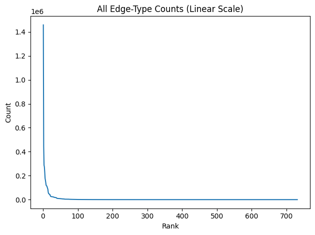
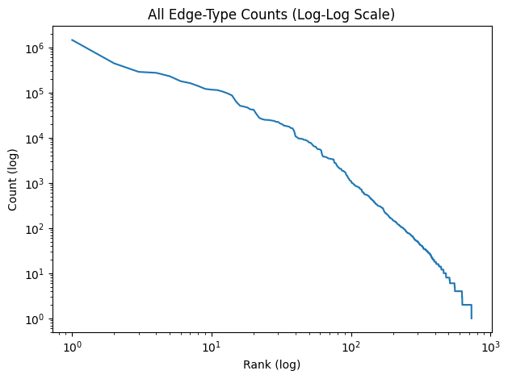

# Knowledge Graphs for Drug Discovery

## Relation Types:
```
'subclass_of', 'related_to', 'has_member', 'has_part', 'coexists_with', 'manifestation_of', 'has_phenotype', 'located_in', 'affects', 'in_taxon', 'biomarker_for', 'has_input', 'gene_associated_with_condition', 'has_participant', 'gene_product_of', 'causes', 'derives_from', 'associated_with', 'capable_of', 'regulates', 'produces', 'physically_interacts_with', 'expressed_in', 'correlated_with', 'chemically_similar_to', 'has_metabolite', 'develops_from', 'occurs_in', 'has_output', 'drug_regulatory_status_world_wide', 'precedes', 'actively_involved_in', 'is_sequence_variant_of', 'has_molecular_consequence', 'lacks_part', 'has_plasma_membrane_part', 'has_increased_amount', 'overlaps', 'has_decreased_amount', 'has_not_completed', 'temporally_related_to', 'directly_physically_interacts_with', 'composed_primarily_of', 'homologous_to', 'indirectly_physically_interacts_with', 'disrupts', 'contributes_to', 'exact_match', 'treats', 'disease_has_location', 'disease_has_basis_in', 'broad_match', 'treats_or_applied_or_studied_to_treat', 'interacts_with', 'predisposes_to_condition', 'preventative_for_condition', 'exacerbates_condition', 'diagnoses', 'colocalizes_with', 'enables', 'contraindicated_in', 'applied_to_treat', 'in_clinical_trials_for'
```

## Conversion Info:
=== Knowledge Graph Conversion ===
Step 1/5: Load nodes
  Total input nodes: 5,864,272
  Input publication nodes: 29,736
Step 2/5: Collapse exact-match entities
  Exact-match unions applied: 249
  Multi-node collapsed entities: 188
  Entity rows written (pre-category): 5,864,023
  Publication entities after collapse: 29,736
Step 3/5: Stream non-subclass edges and collect raw subclass edges
1,000,000 edges written
2,000,000 edges written
3,000,000 edges written
4,000,000 edges written
5,000,000 edges written
6,000,000 edges written
7,000,000 edges written
8,000,000 edges written
9,000,000 edges written
10,000,000 edges written
11,000,000 edges written
12,000,000 edges written
13,000,000 edges written
14,000,000 edges written
15,000,000 edges written
16,000,000 edges written
17,000,000 edges written
18,000,000 edges written
19,000,000 edges written
20,000,000 edges written
21,000,000 edges written
22,000,000 edges written
23,000,000 edges written
24,000,000 edges written
25,000,000 edges written
26,000,000 edges written
27,000,000 edges written
28,000,000 edges written
29,000,000 edges written
30,000,000 edges written
  Relation types retained for training graph: 61
  Training edges written to edges.bin: 30,807,215
  Raw node->node subclass edges collected: 4,485,419
  Raw subclass edges skipped (publication endpoint): 356,113
Step 4/5: Build subclass hierarchy graph
  Synthetic category nodes added to entities.txt: 64
  Total entities after category expansion: 5,864,087
  Node->node subclass edges before SCC pruning: 4,485,419
  Node->node subclass edges removed in SCC pruning: 11,200
  Node->node subclass edges after SCC pruning: 2,428,912
  Node->node subclass graph DAG check: True
  Publication node->biolink:Publication edges added: 29,736
  Synthetic node->category edges added: 5,864,045
  Synthetic category->category edges added: 91
  Augmented subclass edges removed in SCC pruning: 50
  Augmented subclass edges removed in transitive reduction: 1,787,518
  Final subclass edges written to subclass_edge_list.txt: 6,505,480
  Final subclass graph DAG check: True
  Orphan entities after final subclass DAG (no incident subclass edge): 7
Step 5/5: Write relation mappings and relation hierarchy
  Ancestor-only relations added: 9
  Relation labels written to relations.txt: 70
  Final relation hierarchy edges written: 68
  Relation hierarchy edges removed in transitive reduction: 7
=== Conversion Complete ===
Outputs: /home/logansizemore/Documents/knowledge_graph_dd/data/processed/entities.txt, /home/logansizemore/Documents/knowledge_graph_dd/data/processed/relations.txt, /home/logansizemore/Documents/knowledge_graph_dd/data/processed/edges.bin, /home/logansizemore/Documents/knowledge_graph_dd/data/processed/subclass_edge_list.txt, /home/logansizemore/Documents/knowledge_graph_dd/data/processed/relation_hierarchy_edge_list.txt


### Subclass Of Relations:
Total Entities: 5,864,272

```
Subclass_of edges by primary knowledge source:
infores:ncbi-taxonomy	1,384,632
infores:ncit	712,818
infores:icd10pcs-umls	382,248
infores:pr	353,230
infores:mesh	299,906
infores:chebi	263,130
infores:umls-metathesaurus	222,514
infores:fma-umls	207,186
infores:go	187,456
infores:go-plus	106,575
infores:hpo	81,323
infores:omim	77,310
infores:fma-obo	69,055
infores:rxnorm	54,263
infores:mondo	50,632
infores:medrt-umls	47,814
infores:drugbank	46,226
infores:icd9cm-umls	41,770
infores:vandf-umls	38,922
infores:uberon	31,859
infores:ncbi-taxon	30,955
infores:cl	23,607
infores:psy-umls	22,260
infores:hl7-umls	16,518
infores:disease-ontology	16,511
infores:hcp-codes-umls	12,968
infores:drugcentral	9,462
infores:pdq-umls	8,538
infores:pato	8,345
infores:foodon	7,597
infores:ordo	6,903
infores:nddf-umls	5,025
infores:nbo	4,841
infores:medlineplus	3,614
infores:genepio	3,115
infores:atc-codes-umls	2,396
infores:ehdaa2	52
infores:ino	13
infores:ro	13
infores:bspo	1
```

#### Are `subclass_of` Relation Subgraphs DAGs:
At most 2,372,631 entities are either a subclass or a superclass of another entitiy.
```
infores:ncbi-taxonomy
  subclass_of relations: 1,384,632
  entities in subgraph: 692,614
  unique edges in subgraph: 692,316
  is_dag: False
  nontrivial strongly connected components: 1
  component sizes: [2]
infores:ncit
  subclass_of relations: 712,818
  entities in subgraph: 161,579
  unique edges in subgraph: 506,484
  is_dag: False
  nontrivial strongly connected components: 40
  component sizes: [8, 4, 4, 4, 4, 3, 3, 3, 3, 3] ...
infores:icd10pcs-umls
  subclass_of relations: 382,248
  entities in subgraph: 191,125
  unique edges in subgraph: 191,124
  is_dag: True
  nontrivial strongly connected components: 0
  component sizes: none
infores:pr
  subclass_of relations: 353,230
  entities in subgraph: 252,141
  unique edges in subgraph: 352,911
  is_dag: False
  nontrivial strongly connected components: 1
  component sizes: [2]
infores:mesh
  subclass_of relations: 299,906
  entities in subgraph: 170,323
  unique edges in subgraph: 149,569
  is_dag: False
  nontrivial strongly connected components: 33
  component sizes: [4, 3, 3, 2, 2, 2, 2, 2, 2, 2] ...
infores:chebi
  subclass_of relations: 263,130
  entities in subgraph: 183,520
  unique edges in subgraph: 262,748
  is_dag: False
  nontrivial strongly connected components: 27
  component sizes: [6, 4, 4, 3, 3, 3, 3, 3, 3, 2] ...
infores:umls-metathesaurus
  subclass_of relations: 222,514
  entities in subgraph: 110,401
  unique edges in subgraph: 109,632
  is_dag: False
  nontrivial strongly connected components: 200
  component sizes: [8, 8, 7, 6, 5, 5, 5, 4, 4, 4] ...
infores:fma-umls
  subclass_of relations: 207,186
  entities in subgraph: 102,153
  unique edges in subgraph: 103,587
  is_dag: False
  nontrivial strongly connected components: 3
  component sizes: [2, 2, 2]
infores:go
  subclass_of relations: 187,456
  entities in subgraph: 56,374
  unique edges in subgraph: 93,557
  is_dag: False
  nontrivial strongly connected components: 28
  component sizes: [3, 3, 3, 2, 2, 2, 2, 2, 2, 2] ...
infores:go-plus
  subclass_of relations: 106,575
  entities in subgraph: 68,897
  unique edges in subgraph: 106,546
  is_dag: False
  nontrivial strongly connected components: 14
  component sizes: [4, 4, 3, 3, 2, 2, 2, 2, 2, 2] ...
infores:hpo
  subclass_of relations: 81,323
  entities in subgraph: 30,117
  unique edges in subgraph: 40,710
  is_dag: False
  nontrivial strongly connected components: 10
  component sizes: [3, 3, 2, 2, 2, 2, 2, 2, 2, 2]
infores:omim
  subclass_of relations: 77,310
  entities in subgraph: 35,705
  unique edges in subgraph: 38,114
  is_dag: True
  nontrivial strongly connected components: 0
  component sizes: none
infores:fma-obo
  subclass_of relations: 69,055
  entities in subgraph: 69,979
  unique edges in subgraph: 68,956
  is_dag: True
  nontrivial strongly connected components: 0
  component sizes: none
infores:rxnorm
  subclass_of relations: 54,263
  entities in subgraph: 13,070
  unique edges in subgraph: 21,181
  is_dag: False
  nontrivial strongly connected components: 8
  component sizes: [3, 3, 2, 2, 2, 2, 2, 2]
infores:mondo
  subclass_of relations: 50,632
  entities in subgraph: 34,086
  unique edges in subgraph: 50,560
  is_dag: False
  nontrivial strongly connected components: 2
  component sizes: [2, 2]
infores:medrt-umls
  subclass_of relations: 47,814
  entities in subgraph: 17,805
  unique edges in subgraph: 25,287
  is_dag: False
  nontrivial strongly connected components: 1
  component sizes: [3517]
infores:drugbank
  subclass_of relations: 46,226
  entities in subgraph: 9,001
  unique edges in subgraph: 45,030
  is_dag: False
  nontrivial strongly connected components: 2
  component sizes: [2, 2]
infores:icd9cm-umls
  subclass_of relations: 41,770
  entities in subgraph: 20,703
  unique edges in subgraph: 20,809
  is_dag: False
  nontrivial strongly connected components: 40
  component sizes: [5, 3, 2, 2, 2, 2, 2, 2, 2, 2] ...
infores:vandf-umls
  subclass_of relations: 38,922
  entities in subgraph: 14,955
  unique edges in subgraph: 14,797
  is_dag: True
  nontrivial strongly connected components: 0
  component sizes: none
infores:uberon
  subclass_of relations: 31,859
  entities in subgraph: 22,833
  unique edges in subgraph: 31,859
  is_dag: False
  nontrivial strongly connected components: 1
  component sizes: [3]
infores:ncbi-taxon
  subclass_of relations: 30,955
  entities in subgraph: 30,997
  unique edges in subgraph: 30,955
  is_dag: True
  nontrivial strongly connected components: 0
  component sizes: none
infores:cl
  subclass_of relations: 23,607
  entities in subgraph: 15,705
  unique edges in subgraph: 23,607
  is_dag: True
  nontrivial strongly connected components: 0
  component sizes: none
infores:psy-umls
  subclass_of relations: 22,260
  entities in subgraph: 5,792
  unique edges in subgraph: 6,485
  is_dag: False
  nontrivial strongly connected components: 1
  component sizes: [2]
infores:hl7-umls
  subclass_of relations: 16,518
  entities in subgraph: 7,675
  unique edges in subgraph: 8,259
  is_dag: True
  nontrivial strongly connected components: 0
  component sizes: none
infores:disease-ontology
  subclass_of relations: 16,511
  entities in subgraph: 11,647
  unique edges in subgraph: 16,453
  is_dag: False
  nontrivial strongly connected components: 2
  component sizes: [2, 2]
infores:hcp-codes-umls
  subclass_of relations: 12,968
  entities in subgraph: 6,489
  unique edges in subgraph: 6,484
  is_dag: False
  nontrivial strongly connected components: 1
  component sizes: [2]
infores:drugcentral
  subclass_of relations: 9,462
  entities in subgraph: 3,076
  unique edges in subgraph: 9,211
  is_dag: True
  nontrivial strongly connected components: 0
  component sizes: none
infores:pdq-umls
  subclass_of relations: 8,538
  entities in subgraph: 3,618
  unique edges in subgraph: 4,265
  is_dag: False
  nontrivial strongly connected components: 12
  component sizes: [2, 2, 2, 2, 2, 2, 2, 2, 2, 2] ...
infores:pato
  subclass_of relations: 8,345
  entities in subgraph: 5,607
  unique edges in subgraph: 8,345
  is_dag: True
  nontrivial strongly connected components: 0
  component sizes: none
infores:foodon
  subclass_of relations: 7,597
  entities in subgraph: 7,046
  unique edges in subgraph: 7,591
  is_dag: False
  nontrivial strongly connected components: 2
  component sizes: [3, 2]
infores:ordo
  subclass_of relations: 6,903
  entities in subgraph: 6,188
  unique edges in subgraph: 6,893
  is_dag: True
  nontrivial strongly connected components: 0
  component sizes: none
infores:nddf-umls
  subclass_of relations: 5,025
  entities in subgraph: 3,581
  unique edges in subgraph: 3,912
  is_dag: True
  nontrivial strongly connected components: 0
  component sizes: none
infores:nbo
  subclass_of relations: 4,841
  entities in subgraph: 3,312
  unique edges in subgraph: 4,841
  is_dag: True
  nontrivial strongly connected components: 0
  component sizes: none
infores:medlineplus
  subclass_of relations: 3,614
  entities in subgraph: 1,023
  unique edges in subgraph: 1,802
  is_dag: True
  nontrivial strongly connected components: 0
  component sizes: none
infores:genepio
  subclass_of relations: 3,115
  entities in subgraph: 2,204
  unique edges in subgraph: 3,086
  is_dag: True
  nontrivial strongly connected components: 0
  component sizes: none
infores:atc-codes-umls
  subclass_of relations: 2,396
  entities in subgraph: 1,198
  unique edges in subgraph: 1,198
  is_dag: True
  nontrivial strongly connected components: 0
  component sizes: none
infores:ehdaa2
  subclass_of relations: 52
  entities in subgraph: 57
  unique edges in subgraph: 52
  is_dag: True
  nontrivial strongly connected components: 0
  component sizes: none
infores:ino
  subclass_of relations: 13
  entities in subgraph: 18
  unique edges in subgraph: 13
  is_dag: True
  nontrivial strongly connected components: 0
  component sizes: none
infores:ro
  subclass_of relations: 13
  entities in subgraph: 15
  unique edges in subgraph: 13
  is_dag: True
  nontrivial strongly connected components: 0
  component sizes: none
infores:bspo
  subclass_of relations: 1
  entities in subgraph: 2
  unique edges in subgraph: 1
  is_dag: True
  nontrivial strongly connected components: 0
  component sizes: none
```
#### What Entity Categories have `subclass_of` Relations?
Unique category pairs: 731

subclass -> superclass



```
organism-taxon -> organism-taxon: 1,458,078
procedure -> procedure: 443,497
anatomical-entity -> anatomical-entity: 287,292
small-molecule -> chemical-entity: 273,609
disease -> disease: 230,246
biological-process -> biological-process: 178,515
gene -> protein: 161,835
protein -> protein: 139,870
phenotypic-feature -> phenotypic-feature: 120,509
chemical-entity -> chemical-entity: 115,916
publication -> publication: 113,456
protein -> gene: 105,297
chemical-entity -> small-molecule: 96,067
small-molecule -> small-molecule: 86,387
molecular-activity -> molecular-activity: 62,776
small-molecule -> drug: 50,974
drug -> drug: 49,008
disease -> publication: 46,926
gross-anatomical-structure -> gross-anatomical-structure: 42,400
phenotypic-feature -> gross-anatomical-structure: 41,822
information-content-entity -> information-content-entity: 33,150
phenotypic-feature -> publication: 27,416
information-content-entity -> publication: 25,850
procedure -> publication: 24,992
chemical-entity -> publication: 24,769
device -> device: 24,616
cellular-component -> cellular-component: 23,966
chemical-entity -> drug: 23,676
cell -> cell: 22,498
genomic-entity -> gene: 22,388
chemical-entity -> information-content-entity: 20,632
gene -> publication: 19,990
small-molecule -> information-content-entity: 18,570
anatomical-entity -> gross-anatomical-structure: 18,272
biological-process -> phenomenon: 17,855
gene -> gene: 17,538
phenotypic-feature -> disease: 16,416
disease -> phenotypic-feature: 16,228
publication -> information-content-entity: 14,320
small-molecule -> publication: 10,735
molecular-mixture -> chemical-entity: 10,239
chemical-entity -> molecular-mixture: 9,617
phenotypic-feature -> anatomical-entity: 9,574
geographic-location -> geographic-location: 9,464
activity -> activity: 9,363
genomic-entity -> publication: 8,959
phenotypic-feature -> information-content-entity: 8,940
drug -> small-molecule: 8,698
molecular-activity -> biological-process: 8,359
biological-process -> molecular-activity: 7,843
gross-anatomical-structure -> anatomical-entity: 7,815
chemical-entity -> protein: 7,438
protein -> chemical-entity: 6,914
disease -> gross-anatomical-structure: 6,482
population-of-individual-organisms -> population-of-individual-organisms: 6,372
procedure -> information-content-entity: 6,278
drug -> chemical-entity: 5,721
phenomenon -> phenomenon: 5,581
behavior -> behavior: 5,555
device -> physical-entity: 5,470
organism-taxon -> publication: 5,273
gross-anatomical-structure -> publication: 4,223
protein -> publication: 3,834
cohort -> cohort: 3,811
phenotypic-feature -> clinical-attribute: 3,785
molecular-activity -> phenomenon: 3,722
anatomical-entity -> publication: 3,682
molecular-mixture -> drug: 3,545
cell -> publication: 3,464
activity -> publication: 3,460
procedure -> activity: 3,416
drug -> publication: 3,386
geographic-location -> information-content-entity: 3,347
small-molecule -> device: 3,339
protein -> drug: 3,304
disease -> information-content-entity: 2,784
physical-entity -> physical-entity: 2,764
organism-taxon -> information-content-entity: 2,697
disease -> anatomical-entity: 2,414
small-molecule -> molecular-mixture: 2,332
agent -> agent: 2,202
anatomical-entity -> information-content-entity: 2,169
chemical-entity -> complex-molecular-mixture: 2,061
molecular-mixture -> information-content-entity: 2,046
phenomenon -> biological-process: 2,039
information-content-entity -> activity: 1,884
protein -> information-content-entity: 1,840
drug -> device: 1,839
chemical-entity -> organism-taxon: 1,793
geographic-location -> publication: 1,747
activity -> information-content-entity: 1,708
molecular-mixture -> small-molecule: 1,563
information-content-entity -> phenotypic-feature: 1,467
chemical-entity -> device: 1,430
cohort -> publication: 1,309
gene -> chemical-entity: 1,273
phenotypic-feature -> activity: 1,193
activity -> procedure: 1,137
physical-entity -> publication: 1,120
small-molecule -> protein: 1,102
gross-anatomical-structure -> information-content-entity: 1,004
device -> publication: 1,001
drug -> information-content-entity: 980
disease -> genomic-entity: 950
drug -> molecular-mixture: 914
disease -> biological-process: 910
behavior -> phenotypic-feature: 869
phenotypic-feature -> procedure: 856
population-of-individual-organisms -> publication: 838
pathway -> pathway: 837
procedure -> device: 830
device -> drug: 814
chemical-entity -> polypeptide: 800
physical-entity -> device: 791
phenotypic-feature -> biological-process: 787
procedure -> phenotypic-feature: 741
phenomenon -> disease: 725
disease -> clinical-attribute: 720
publication -> activity: 714
polypeptide -> polypeptide: 638
chemical-mixture -> chemical-mixture: 627
device -> chemical-entity: 625
behavior -> information-content-entity: 592
device -> information-content-entity: 591
small-molecule -> anatomical-entity: 557
information-content-entity -> behavior: 553
molecular-mixture -> molecular-mixture: 553
agent -> publication: 550
molecular-mixture -> publication: 548
phenotypic-feature -> behavior: 536
cellular-component -> anatomical-entity: 535
publication -> procedure: 522
clinical-attribute -> publication: 518
procedure -> small-molecule: 510
agent -> cohort: 498
disease -> phenomenon: 472
cell -> chemical-entity: 464
protein -> small-molecule: 464
cell -> anatomical-entity: 441
anatomical-entity -> cellular-component: 439
biological-process -> information-content-entity: 423
information-content-entity -> procedure: 423
publication -> phenotypic-feature: 410
device -> procedure: 406
physical-entity -> information-content-entity: 400
phenomenon -> information-content-entity: 374
cohort -> information-content-entity: 373
molecular-activity -> information-content-entity: 373
biological-process -> disease: 356
biological-process -> phenotypic-feature: 343
biological-process -> publication: 339
small-molecule -> disease: 339
polypeptide -> chemical-entity: 336
phenotypic-feature -> phenomenon: 325
information-content-entity -> biological-process: 316
disease -> behavior: 311
drug -> protein: 310
complex-molecular-mixture -> complex-molecular-mixture: 309
cohort -> population-of-individual-organisms: 307
chemical-entity -> gene: 306
information-content-entity -> phenomenon: 305
small-molecule -> polypeptide: 298
biological-process -> behavior: 297
information-content-entity -> molecular-activity: 294
population-of-individual-organisms -> information-content-entity: 285
cell -> information-content-entity: 283
cellular-component -> publication: 282
activity -> behavior: 276
phenomenon -> phenotypic-feature: 276
agent -> activity: 269
cell -> gross-anatomical-structure: 252
nucleic-acid-entity -> nucleic-acid-entity: 242
phenomenon -> publication: 237
behavior -> biological-process: 227
molecular-mixture -> device: 218
chemical-entity -> anatomical-entity: 216
behavior -> activity: 215
anatomical-entity -> disease: 210
disease -> population-of-individual-organisms: 210
activity -> device: 206
small-molecule -> chemical-mixture: 199
cell -> drug: 198
drug -> complex-molecular-mixture: 196
phenotypic-feature -> cohort: 194
behavior -> disease: 191
procedure -> disease: 184
procedure -> biological-process: 181
behavior -> publication: 176
agent -> information-content-entity: 175
clinical-attribute -> phenotypic-feature: 168
information-content-entity -> clinical-attribute: 168
behavior -> phenomenon: 166
clinical-attribute -> information-content-entity: 165
cellular-component -> cell: 162
organism-taxon -> drug: 161
information-content-entity -> anatomical-entity: 160
protein -> polypeptide: 158
publication -> physical-entity: 156
nucleic-acid-entity -> publication: 151
procedure -> anatomical-entity: 148
protein -> molecular-mixture: 148
activity -> agent: 145
anatomical-entity -> cell: 144
chemical-entity -> physical-entity: 143
chemical-entity -> chemical-mixture: 142
information-content-entity -> disease: 140
phenomenon -> activity: 140
gene -> information-content-entity: 138
physiological-process -> physiological-process: 138
behavior -> procedure: 134
clinical-attribute -> clinical-attribute: 134
device -> activity: 133
activity -> phenotypic-feature: 128
molecular-mixture -> protein: 125
physiological-process -> biological-process: 124
biological-process -> procedure: 122
polypeptide -> small-molecule: 122
information-content-entity -> population-of-individual-organisms: 120
complex-molecular-mixture -> chemical-entity: 119
drug -> procedure: 119
phenomenon -> molecular-activity: 118
clinical-attribute -> biological-process: 113
complex-molecular-mixture -> publication: 113
small-molecule -> complex-molecular-mixture: 113
gene -> biological-process: 112
biological-entity -> cell: 110
cellular-component -> protein: 109
pathway -> biological-process: 105
population-of-individual-organisms -> phenotypic-feature: 105
gene -> genomic-entity: 104
physical-entity -> agent: 104
polypeptide -> information-content-entity: 104
activity -> phenomenon: 103
genomic-entity -> procedure: 102
physical-entity -> activity: 102
chemical-entity -> cell: 101
procedure -> behavior: 100
organism-taxon -> nucleic-acid-entity: 96
procedure -> phenomenon: 96
cohort -> phenotypic-feature: 95
phenomenon -> behavior: 94
chemical-entity -> procedure: 93
drug -> organism-taxon: 93
disease -> procedure: 92
gene -> clinical-attribute: 91
behavior -> clinical-attribute: 86
polypeptide -> protein: 86
publication -> behavior: 86
procedure -> chemical-entity: 84
publication -> device: 82
cohort -> disease: 81
chemical-entity -> clinical-attribute: 80
physical-entity -> chemical-entity: 80
agent -> physical-entity: 78
information-content-entity -> chemical-entity: 78
activity -> biological-process: 77
event -> publication: 77
phenomenon -> clinical-attribute: 77
phenomenon -> procedure: 77
biological-entity -> disease: 76
cellular-component -> gross-anatomical-structure: 76
cohort -> activity: 75
molecular-mixture -> chemical-mixture: 75
anatomical-entity -> phenotypic-feature: 74
phenotypic-feature -> population-of-individual-organisms: 73
chemical-entity -> phenomenon: 72
cohort -> agent: 72
chemical-mixture -> chemical-entity: 71
agent -> population-of-individual-organisms: 70
anatomical-entity -> chemical-entity: 68
biological-process -> physiological-process: 68
molecular-mixture -> polypeptide: 68
polypeptide -> publication: 67
cellular-component -> chemical-entity: 66
event -> phenotypic-feature: 66
information-content-entity -> physical-entity: 66
biological-process -> activity: 64
chemical-entity -> disease: 64
drug -> cell: 62
protein -> complex-molecular-mixture: 62
organism-taxon -> chemical-entity: 61
clinical-attribute -> procedure: 60
molecular-activity -> chemical-entity: 58
protein -> anatomical-entity: 58
gross-anatomical-structure -> cell: 56
protein -> cellular-component: 56
drug -> molecular-activity: 55
procedure -> drug: 55
biological-entity -> biological-entity: 54
disease-or-phenotypic-feature -> publication: 54
event -> information-content-entity: 54
information-content-entity -> cohort: 53
anatomical-entity -> biological-process: 52
chemical-entity -> genomic-entity: 52
disease -> activity: 52
disease -> cohort: 52
genomic-entity -> genomic-entity: 52
disease -> event: 51
molecular-activity -> publication: 51
information-content-entity -> geographic-location: 50
nucleic-acid-entity -> chemical-entity: 50
population-of-individual-organisms -> cohort: 50
chemical-entity -> biological-process: 48
device -> small-molecule: 48
organism-taxon -> disease: 48
small-molecule -> organism-taxon: 47
disease -> chemical-entity: 46
physical-entity -> phenomenon: 46
activity -> disease: 44
event -> event: 44
gross-anatomical-structure -> cellular-component: 44
publication -> phenomenon: 43
biological-process -> anatomical-entity: 42
drug -> biological-process: 42
drug -> phenomenon: 42
drug -> physical-entity: 42
information-content-entity -> gross-anatomical-structure: 42
physiological-process -> molecular-activity: 42
gene -> polypeptide: 41
biological-process -> cellular-component: 40
gene -> cellular-component: 40
geographic-location -> agent: 40
molecular-activity -> physiological-process: 40
nucleic-acid-entity -> cellular-component: 40
procedure -> molecular-mixture: 40
chemical-entity -> cellular-component: 38
information-content-entity -> agent: 38
polypeptide -> drug: 38
cellular-component -> gene: 36
disease -> cell: 36
phenomenon -> chemical-entity: 36
small-molecule -> molecular-activity: 36
activity -> physical-entity: 34
activity -> population-of-individual-organisms: 34
anatomical-entity -> clinical-attribute: 34
biological-process -> gross-anatomical-structure: 34
cell -> cellular-component: 34
chemical-entity -> molecular-activity: 34
chemical-entity -> nucleic-acid-entity: 34
human -> population-of-individual-organisms: 34
human -> publication: 34
phenotypic-feature -> disease-or-phenotypic-feature: 34
biological-process -> clinical-attribute: 33
population-of-individual-organisms -> behavior: 33
biological-process -> chemical-entity: 32
biological-process -> population-of-individual-organisms: 32
gene -> drug: 32
procedure -> clinical-attribute: 32
procedure -> population-of-individual-organisms: 32
molecular-activity -> disease: 31
molecular-activity -> protein: 31
disease -> molecular-activity: 30
drug -> activity: 30
information-content-entity -> drug: 30
molecular-activity -> cellular-component: 30
physical-entity -> procedure: 30
protein -> genomic-entity: 30
activity -> cohort: 28
cellular-component -> biological-process: 28
cellular-component -> information-content-entity: 28
disease -> organism-taxon: 28
disease-or-phenotypic-feature -> information-content-entity: 28
nucleic-acid-entity -> polypeptide: 28
small-molecule -> activity: 28
small-molecule -> physical-entity: 28
small-molecule -> procedure: 28
agent -> procedure: 26
clinical-attribute -> activity: 26
device -> anatomical-entity: 26
gross-anatomical-structure -> disease: 26
organism-taxon -> anatomical-entity: 26
phenotypic-feature -> cell: 26
phenotypic-feature -> event: 26
chemical-entity -> molecular-entity: 24
event -> phenomenon: 24
phenotypic-feature -> chemical-entity: 24
genomic-entity -> chemical-entity: 23
population-of-individual-organisms -> agent: 23
anatomical-entity -> activity: 22
geographic-location -> phenomenon: 22
information-content-entity -> polypeptide: 22
nucleic-acid-entity -> biological-process: 22
nucleic-acid-entity -> gene: 22
chemical-entity -> activity: 21
molecular-mixture -> complex-molecular-mixture: 21
cell -> disease: 20
cellular-component -> organism-taxon: 20
cellular-component -> phenotypic-feature: 20
drug -> anatomical-entity: 20
drug -> polypeptide: 20
gene -> nucleic-acid-entity: 20
information-content-entity -> event: 20
physical-entity -> geographic-location: 20
protein -> phenotypic-feature: 20
cellular-component -> molecular-activity: 18
clinical-attribute -> anatomical-entity: 18
disease -> gene: 18
genomic-entity -> protein: 18
information-content-entity -> device: 18
information-content-entity -> protein: 18
named-thing -> publication: 18
nucleic-acid-entity -> information-content-entity: 18
phenotypic-feature -> cellular-component: 18
phenotypic-feature -> protein: 18
publication -> biological-entity: 18
behavior -> cohort: 17
clinical-attribute -> phenomenon: 17
molecular-mixture -> anatomical-entity: 17
agent -> phenotypic-feature: 16
biological-process -> molecular-entity: 16
biological-process -> protein: 16
cell -> biological-process: 16
cohort -> gross-anatomical-structure: 16
disease -> cellular-component: 16
gene -> molecular-mixture: 16
organism-taxon -> cell: 16
organism-taxon -> complex-molecular-mixture: 16
phenomenon -> event: 16
procedure -> agent: 16
procedure -> gene: 16
procedure -> physical-entity: 16
small-molecule -> gene: 16
anatomical-entity -> procedure: 15
behavior -> population-of-individual-organisms: 15
disease-or-phenotypic-feature -> phenotypic-feature: 15
human -> information-content-entity: 15
molecular-activity -> drug: 15
molecular-mixture -> disease: 15
activity -> anatomical-entity: 14
behavior -> agent: 14
chemical-entity -> phenotypic-feature: 14
cohort -> behavior: 14
device -> cellular-component: 14
genomic-entity -> information-content-entity: 14
information-content-entity -> organism-taxon: 14
molecular-activity -> small-molecule: 14
nucleic-acid-entity -> phenomenon: 14
phenomenon -> physical-entity: 14
phenomenon -> small-molecule: 14
polypeptide -> gene: 14
procedure -> gross-anatomical-structure: 14
publication -> clinical-attribute: 14
procedure -> molecular-activity: 13
publication -> drug: 13
activity -> biological-entity: 12
biological-entity -> organism-taxon: 12
cell -> phenotypic-feature: 12
cellular-component -> phenomenon: 12
chemical-entity -> gross-anatomical-structure: 12
chemical-mixture -> small-molecule: 12
disease -> biological-entity: 12
drug -> disease: 12
geographic-location -> activity: 12
molecular-activity -> procedure: 12
named-thing -> information-content-entity: 12
nucleic-acid-entity -> molecular-entity: 12
phenomenon -> geographic-location: 12
phenotypic-feature -> device: 12
phenotypic-feature -> small-molecule: 12
publication -> anatomical-entity: 12
molecular-entity -> publication: 11
activity -> event: 10
biological-entity -> publication: 10
biological-process -> small-molecule: 10
cell -> organism-taxon: 10
cellular-component -> nucleic-acid-entity: 10
clinical-attribute -> behavior: 10
clinical-attribute -> gross-anatomical-structure: 10
disease -> nucleic-acid-entity: 10
event -> behavior: 10
human -> organism-taxon: 10
molecular-activity -> phenotypic-feature: 10
organism-taxon -> phenotypic-feature: 10
phenomenon -> disease-or-phenotypic-feature: 10
physical-entity -> drug: 10
physical-entity -> named-thing: 10
protein -> clinical-attribute: 10
protein -> organism-taxon: 10
small-molecule -> gross-anatomical-structure: 10
organism-taxon -> procedure: 9
anatomical-entity -> drug: 8
cell -> procedure: 8
cellular-component -> polypeptide: 8
clinical-attribute -> chemical-entity: 8
complex-molecular-mixture -> protein: 8
event -> disease: 8
gene -> organism-taxon: 8
gene -> procedure: 8
geographic-location -> physical-entity: 8
information-content-entity -> cell: 8
information-content-entity -> named-thing: 8
named-thing -> named-thing: 8
organism-taxon -> phenomenon: 8
phenomenon -> device: 8
phenomenon -> molecular-entity: 8
physical-entity -> anatomical-entity: 8
polypeptide -> molecular-mixture: 8
population-of-individual-organisms -> activity: 8
population-of-individual-organisms -> human: 8
population-of-individual-organisms -> organism-taxon: 8
procedure -> complex-molecular-mixture: 8
protein -> activity: 8
protein -> gross-anatomical-structure: 8
protein -> physical-entity: 8
protein -> procedure: 8
publication -> agent: 8
publication -> nucleic-acid-entity: 8
small-molecule -> phenotypic-feature: 8
agent -> behavior: 7
complex-molecular-mixture -> drug: 7
complex-molecular-mixture -> information-content-entity: 7
agent -> geographic-location: 6
anatomical-entity -> organism-taxon: 6
behavior -> anatomical-entity: 6
behavior -> device: 6
biological-entity -> device: 6
cell -> complex-molecular-mixture: 6
cellular-component -> device: 6
clinical-attribute -> disease: 6
cohort -> anatomical-entity: 6
cohort -> phenomenon: 6
complex-molecular-mixture -> disease: 6
device -> agent: 6
disease -> small-molecule: 6
event -> activity: 6
event -> biological-process: 6
genomic-entity -> disease: 6
geographic-location -> chemical-entity: 6
gross-anatomical-structure -> biological-process: 6
gross-anatomical-structure -> chemical-entity: 6
gross-anatomical-structure -> cohort: 6
information-content-entity -> gene: 6
information-content-entity -> molecular-entity: 6
molecular-entity -> information-content-entity: 6
molecular-mixture -> physical-entity: 6
organism-taxon -> activity: 6
phenomenon -> anatomical-entity: 6
phenotypic-feature -> geographic-location: 6
phenotypic-feature -> molecular-activity: 6
phenotypic-feature -> physical-entity: 6
physical-entity -> behavior: 6
physical-entity -> disease: 6
physical-entity -> phenotypic-feature: 6
physical-entity -> small-molecule: 6
polypeptide -> disease: 6
population-of-individual-organisms -> gross-anatomical-structure: 6
procedure -> organism-taxon: 6
procedure -> protein: 6
protein -> biological-process: 6
protein -> cell: 6
publication -> disease-or-phenotypic-feature: 6
publication -> event: 6
drug -> phenotypic-feature: 5
genomic-entity -> clinical-attribute: 5
organism-taxon -> device: 5
activity -> chemical-entity: 4
activity -> drug: 4
agent -> device: 4
agent -> phenomenon: 4
anatomical-entity -> device: 4
anatomical-entity -> physical-entity: 4
anatomical-entity -> protein: 4
behavior -> gross-anatomical-structure: 4
behavior -> organism-taxon: 4
biological-entity -> activity: 4
biological-entity -> information-content-entity: 4
biological-process -> drug: 4
biological-process -> gene: 4
biological-process -> polypeptide: 4
cell -> activity: 4
cell-line -> cell-line: 4
cellular-component -> clinical-attribute: 4
cellular-component -> disease: 4
cellular-component -> small-molecule: 4
chemical-entity -> behavior: 4
chemical-mixture -> physical-entity: 4
chemical-mixture -> publication: 4
clinical-attribute -> drug: 4
complex-molecular-mixture -> anatomical-entity: 4
complex-molecular-mixture -> organism-taxon: 4
device -> gene: 4
device -> molecular-mixture: 4
device -> phenomenon: 4
disease -> molecular-entity: 4
disease -> protein: 4
disease-or-phenotypic-feature -> disease-or-phenotypic-feature: 4
drug -> named-thing: 4
gene -> anatomical-entity: 4
gene -> geographic-location: 4
genomic-entity -> biological-process: 4
genomic-entity -> phenotypic-feature: 4
gross-anatomical-structure -> phenotypic-feature: 4
human -> human: 4
information-content-entity -> cellular-component: 4
information-content-entity -> disease-or-phenotypic-feature: 4
information-content-entity -> physiological-process: 4
information-content-entity -> small-molecule: 4
molecular-activity -> gene: 4
molecular-activity -> genomic-entity: 4
molecular-activity -> polypeptide: 4
molecular-entity -> biological-process: 4
molecular-entity -> disease: 4
molecular-entity -> phenomenon: 4
named-thing -> physical-entity: 4
nucleic-acid-entity -> small-molecule: 4
organism-taxon -> biological-process: 4
organism-taxon -> named-thing: 4
phenomenon -> agent: 4
phenotypic-feature -> agent: 4
phenotypic-feature -> drug: 4
phenotypic-feature -> gene: 4
physical-entity -> complex-molecular-mixture: 4
physical-entity -> gene: 4
polypeptide -> anatomical-entity: 4
polypeptide -> nucleic-acid-entity: 4
population-of-individual-organisms -> disease: 4
procedure -> cohort: 4
protein -> device: 4
protein -> molecular-activity: 4
protein -> molecular-entity: 4
publication -> cell: 4
publication -> chemical-entity: 4
publication -> gross-anatomical-structure: 4
publication -> named-thing: 4
agent -> biological-process: 3
physical-entity -> cohort: 3
publication -> cohort: 3
activity -> clinical-attribute: 2
activity -> gross-anatomical-structure: 2
activity -> molecular-entity: 2
activity -> organism-taxon: 2
activity -> small-molecule: 2
agent -> named-thing: 2
anatomical-entity -> gene: 2
anatomical-entity -> genomic-entity: 2
anatomical-entity -> human: 2
anatomical-entity -> molecular-activity: 2
anatomical-entity -> molecular-entity: 2
anatomical-entity -> phenomenon: 2
behavior -> chemical-entity: 2
behavior -> event: 2
biological-entity -> procedure: 2
biological-process -> event: 2
biological-process -> genomic-entity: 2
biological-process -> nucleic-acid-entity: 2
biological-process -> organism-taxon: 2
cell -> clinical-attribute: 2
cell -> human: 2
cellular-component -> activity: 2
cellular-component -> molecular-entity: 2
cellular-component -> procedure: 2
chemical-entity -> agent: 2
chemical-entity -> geographic-location: 2
chemical-entity -> named-thing: 2
chemical-entity -> population-of-individual-organisms: 2
chemical-mixture -> information-content-entity: 2
cohort -> biological-process: 2
cohort -> physical-entity: 2
cohort -> procedure: 2
complex-molecular-mixture -> phenomenon: 2
device -> behavior: 2
device -> disease: 2
device -> organism-taxon: 2
device -> phenotypic-feature: 2
device -> population-of-individual-organisms: 2
device -> protein: 2
disease -> disease-or-phenotypic-feature: 2
disease -> physical-entity: 2
disease-or-phenotypic-feature -> phenomenon: 2
disease-or-phenotypic-feature -> procedure: 2
drug -> behavior: 2
drug -> clinical-attribute: 2
drug -> gene: 2
gene -> activity: 2
gene -> phenomenon: 2
gene -> phenotypic-feature: 2
genomic-entity -> anatomical-entity: 2
gross-anatomical-structure -> activity: 2
gross-anatomical-structure -> clinical-attribute: 2
gross-anatomical-structure -> organism-taxon: 2
gross-anatomical-structure -> population-of-individual-organisms: 2
information-content-entity -> genomic-entity: 2
information-content-entity -> human: 2
information-content-entity -> nucleic-acid-entity: 2
molecular-activity -> activity: 2
molecular-activity -> molecular-entity: 2
molecular-entity -> anatomical-entity: 2
molecular-entity -> gene: 2
molecular-entity -> molecular-entity: 2
molecular-mixture -> gross-anatomical-structure: 2
molecular-mixture -> organism-taxon: 2
molecular-mixture -> procedure: 2
named-thing -> device: 2
named-thing -> drug: 2
nucleic-acid-entity -> anatomical-entity: 2
nucleic-acid-entity -> complex-molecular-mixture: 2
nucleic-acid-entity -> drug: 2
nucleic-acid-entity -> organism-taxon: 2
nucleic-acid-entity -> procedure: 2
organism-taxon -> agent: 2
organism-taxon -> behavior: 2
organism-taxon -> cellular-component: 2
organism-taxon -> geographic-location: 2
organism-taxon -> gross-anatomical-structure: 2
organism-taxon -> human: 2
organism-taxon -> physical-entity: 2
organism-taxon -> polypeptide: 2
organism-taxon -> population-of-individual-organisms: 2
organism-taxon -> protein: 2
organism-taxon -> small-molecule: 2
phenomenon -> population-of-individual-organisms: 2
phenomenon -> protein: 2
phenotypic-feature -> organism-taxon: 2
physical-entity -> chemical-mixture: 2
physical-entity -> population-of-individual-organisms: 2
physiological-process -> phenomenon: 2
polypeptide -> cellular-component: 2
polypeptide -> molecular-entity: 2
polypeptide -> phenomenon: 2
population-of-individual-organisms -> anatomical-entity: 2
procedure -> cell: 2
procedure -> named-thing: 2
protein -> chemical-mixture: 2
publication -> biological-process: 2
publication -> disease: 2
publication -> organism-taxon: 2
small-molecule -> cell: 2
small-molecule -> cellular-component: 2
small-molecule -> genomic-entity: 2
small-molecule -> molecular-entity: 2
phenomenon -> drug: 1
```